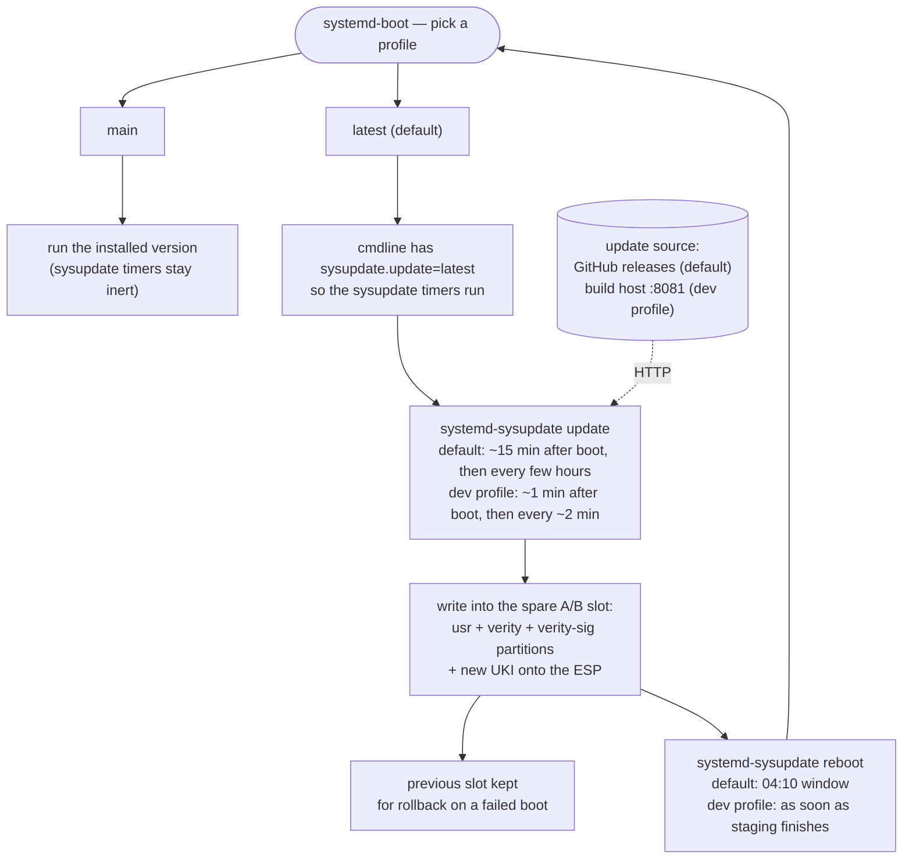
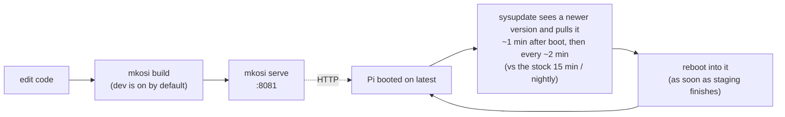

## Raspberry Pi 4B + `mkosi` + `systemd`

Inspired by https://0pointer.net/blog/fitting-everything-together.html 

### Included in the image

1. ESP (`/efi`) partition
   * `boot.img` that contains RPi firmware & config + EDK2 firmware with Secure Boot using our custom cert (`mkosi.crt`)
   * `boot.sig` signed with `mkosi.key`. `mkosi.crt` should be included in EEPROM (using `rpi-eeprom-config`) to make the boot chain secure
   * `boot.img` + `boot.sig` are also emitted standalone into `mkosi.output/` (and attached to releases) for TFTP/HTTP netboot
   * Unified Kernel Image (UKI), signed with `mkosi.key`
     * `linux-image-generic` from the distribution 
     * `rpi-crypto-passphrase` kernel module (`rpi-crypto-passphrase.c`), a small
       out-of-tree bridge to the firmware's mailbox crypto service, built against the upstream
       `rpi_firmware_property()` API
2. Readonly `/usr` partition
   * Debian Forky distribution, other systemd>=256 distros should work too
   * "Golden" `/etc` stored into `/usr/share/factory/etc`
   * verity & verity-sig partitions make sure the contents are not tampered with

### On first boot

1. Create encrypted root partition
   * passphrase derived by the firmware mailbox's crypto service: HMAC-SHA256 of the root
     disk's own hardware id (MMC CID / NVMe serial), using the OTP-provisioned private key
     ([RPi eeprom OTP registry](https://www.raspberrypi.com/documentation/computers/raspberry-pi.html#otp-register-and-bit-definitions)).
     The raw private key never leaves the firmware, and the firmware locks it against further
     use for the rest of the boot right after computing the HMAC
     (`root-passphrase.socket`/`.service` + `systemd-repart`'s `KeyFile=` connect-socket support)
   * `/etc` populated from `/usr/share/factory/etc` using `systemd-repart`'s `CopyFiles=`
   * other root directories & files populated with `systemd-tmpfiles` (no custom configuration)
2. Create 3 empty matching-size partitions (labeled `_empty`) for `/usr` updates

### On every boot



The UKI carries a second profile, **`latest`**, that opts in to automatic
updates — its command line adds `sysupdate.update=latest`, and both stock
systemd timers are gated behind
`ConditionKernelCommandLine=sysupdate.update=latest`:

1. `systemd-sysupdate.timer` → `systemd-sysupdate update` downloads the new
   `usr` + `verity` + `verity-sig` into the spare `_empty` partitions and the
   new UKI into the ESP (15min after boot, then every few hours).
2. `systemd-sysupdate-reboot.timer` → reboots into a newer version once one has
   been fully staged (04:10 window). Drop-ins:
   * skip while `systemd-sysupdate.service` is still running — its `reboot` verb
     counts a half-written version as installed
     ([systemd#33339](https://github.com/systemd/systemd/issues/33339)) and would
     otherwise loop-reboot mid-download
   * `shutdown --reboot +2 "…"` (wall + grace) when someone is logged in,
     `+0` otherwise, instead of `systemd-sysupdate reboot`'s one-warning drop

The spare `_empty` partitions these downloads land in are created by
`systemd-repart` in the initrd on first boot, long before the timers fire.

**`main`** (`@0`, the base profile `ukify` always emits) leaves both timers
inert — boot it to stay on the installed version, e.g. if `latest` just broke.
`latest` is the default (`efi/loader/loader.conf`), so this needs picking
manually at the menu.

`systemd-sysupdate` reads the transfer definitions from `/usr/lib/sysupdate.d/`;
by default the source is this repo's GitHub releases. Auto-rollback to the
previous version on a failed boot is wired but untested.

### Reproducible builds

Package versions are pinned to [snapshot.debian.org](https://snapshot.debian.org)
timestamps in [`mkosi.conf`](mkosi.conf) (`Snapshot=` for the image,
`ToolsTreeSnapshot=` for the build tools tree), and the build is
byte-reproducible: two builds of the same commit produce an identical disk image
(`system_<ver>.raw`), UKI (`system_<ver>.efi`), rootfs tarball, initrd,
`boot.img` and `usr` / verity / verity-sig partitions. CI pins
`SOURCE_DATE_EPOCH` to the commit timestamp and writes a static `mkosi.seed`
(the repart seed); to reproduce locally:

```bash
echo -n 8c58b3b9-7383-50e6-aed7-8d8341fdaf5f > mkosi.seed
SOURCE_DATE_EPOCH=$(git log -1 --format=%ct) mkosi --profile= --profile=release -f build
```

(`--profile= --profile=release` matches what CI builds - see
[Profiles](#profiles) below. Without it you'd be comparing against your own
`dev`-profile build instead, which is still reproducible, just not the same
image CI ships.)

### Versioning

[`mkosi.version`](mkosi.version) is a script: `git describe` on a release build
(so exactly the tag), `<tag>-<n>-g<sha>` in between, plus `-<unix-time>` when the
tree is dirty. `systemd-sysupdate`'s version compare ranks every one of those
above the last release, so the local loop just works:

```bash
git switch -c my-change
# edit mkosi.conf / add a package / ...
mkosi build && mkosi serve   # a device pointed at this will sysupdate to it
```

(Commit the change for a stable version; the `-<unix-time>` suffix on a dirty
tree still advances on every build.)

### Package updates

Both driven by [`valtzu/gh-action-mkosi-bump`](https://github.com/valtzu/gh-action-mkosi-bump),
no PAT:

* [`Weekly package release`](.github/workflows/mkosi-bump.yml) — **Friday 19:00
  UTC**: moves `Snapshot=` to the newest `mkosi latest-snapshot` timestamp,
  commits it straight to `main`, tags the next patch version, and
  `workflow_dispatch`es [`mkosi.yml`](.github/workflows/mkosi.yml) on that tag.
  The release job builds, uploads the assets to a draft, then flips it to
  published + latest. Devices pick it up on their next `systemd-sysupdate` poll
  and reboot into it at `systemd-sysupdate-reboot.timer` (04:10 local), so the
  rollout lands over the weekend nights. No review gate - auto-rollback covers a
  bad boot, but a broken package set still reaches every device until the next
  release.
* [`Bump mkosi tools tree`](.github/workflows/mkosi-bump-tools-tree.yml) — moves
  `ToolsTreeSnapshot=` in a rolling `mkosi-bump-tools-tree` PR. A tools-tree bump
  can break the build, so it goes through review; the PR is built by the
  `pull_request` trigger in `mkosi.yml` (click *Approve workflows to run* on it,
  since a `GITHUB_TOKEN`-opened PR's checks start pending).

## Setup dev env

`mkosi` runs unprivileged now, so the build happens directly on the host - no
VM. You need a recent systemd (>=256) and `mkosi` v27:

```bash
pipx install git+https://github.com/systemd/mkosi.git@v27
```

Cross-building for aarch64 also needs `qemu-user-static` + `binfmt-support` (or
your distro's equivalent) registered.

### Profiles

`dev` is on by default (`Profiles=dev` in [`mkosi.conf`](mkosi.conf)), so a
bare `mkosi build`/`mkosi vm`/`mkosi serve` is the fast local iterate loop
described below - no `--profile` needed.

* **`dev`** - on by default. Points sysupdate at this build host instead of
  GitHub releases, compresses artifacts for the transfer, and speeds up the
  update/reboot cadence - see [Fast iteration](#fast-iteration-on-real-hardware)
  below.
* **`release`** - off by default, what CI builds with. Resets `Profiles=` to
  drop `dev`, so the build points at GitHub releases, keeps the package
  changelog, and uses the stock update cadence:
  ```bash
  mkosi --profile= --profile=release build
  ```
  (the empty `--profile=` resets the list instead of appending to it - see
  mkosi's docs on collection-type settings.)

### Generate Secure Boot keys
```
mkosi --directory="" genkey
```

### Build image for Raspberry Pi
```
mkosi
```

### Run on host
```
mkosi vm
```

### Fast iteration on real hardware

The `dev` profile (see [Profiles](#profiles) above - on by default):

1. drops `[Source] Path=` overrides into the `sysupdate.d` transfers (via
   `*.transfer.d/`) so they pull from this build host (`mkosi serve`, HTTP port
   8081) instead of GitHub releases — the base `MatchPattern` lists both the
   `.xz` (releases) and `.zst` (dev) name,
2. `mkosi.postoutput` runs `zstd --fast` over the split artifacts — the `usr`
   partition is a 2 GB ext4 image that's mostly zeros, so this is ~4× less to
   transfer for almost no CPU either end,
3. defaults the boot menu to the `latest` entry (`loader.conf`),
4. runs the update check ~1min after boot then every ~2min (`RandomizedDelaySec=0`),
5. reboots the instant an update finishes staging (`OnSuccess=` chained off
   `systemd-sysupdate.service`) instead of waiting for the 04:10 window, and
6. streams its journal to the build host via `systemd-journal-upload`, so a
   reboot loop is still debuggable after it takes the network/serial console
   down with it. `systemd-journal-remote` (to receive it) lives in the tools
   tree (`ToolsTreePackages=` in `mkosi.conf`) rather than needing a host
   package install - `mkosi box` runs it with real host networking:
   ```
   mkosi box -- /usr/lib/systemd/systemd-journal-remote \
     --listen-http=0.0.0.0:19532 --split-mode=none --output=rpi-dev.journal
   mkosi box -- journalctl --merge -fe --file rpi-dev.journal   # in another shell
   ```

A Pi on the same network re-flashes itself from your working tree shortly after
each boot:



```
mkosi build      # build; the build host IP is autodetected
mkosi serve      # serve mkosi.output/ on :8081
```

The build host address is resolved in `mkosi.sync` (`hostname -I`); override it
with `SYSUPDATE_HOST=<ip> mkosi build` if the wrong interface is picked.
