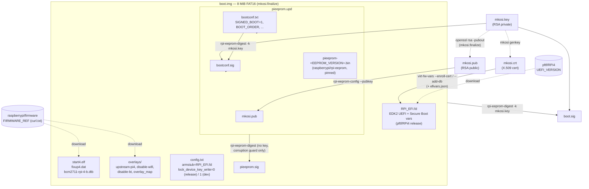
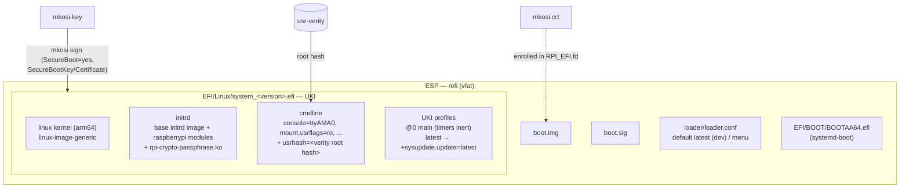
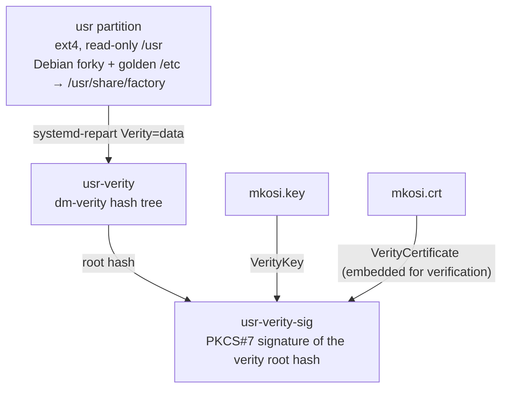
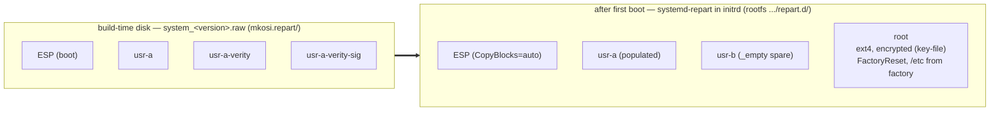

# Image layout & signing chain

How the build artifacts fit together and which key signs what. See the
[README](../README.md) for the boot / update flow; this doc is just the static
picture.

## Signing keys

One key pair (`mkosi genkey`) is the root of trust for everything:

| File | What it is | Where it comes from |
| --- | --- | --- |
| `mkosi.key` | RSA private key | `mkosi genkey` (kept off-device) |
| `mkosi.crt` | X.509 cert wrapping the public key | `mkosi genkey` |
| `mkosi.pub` | bare RSA public key | `openssl rsa -in mkosi.key -pubout`, in `mkosi.images/rootfs/mkosi.finalize` |

`mkosi.crt` is what verifies UEFI Secure Boot and the dm-verity signature;
`mkosi.pub` is the form `rpi-eeprom-config` embeds so the bootloader can verify
its own updates and `boot.img`.

## `boot.img` and the EEPROM update

`boot.img` is an 8 MiB FAT16 image built by
[`mkosi.images/rootfs/mkosi.finalize`](../mkosi.images/rootfs/mkosi.finalize).
It is copied into the ESP **and** emitted standalone into `mkosi.output/`
(with `boot.sig`) for TFTP/HTTP netboot.

The EEPROM verifies `pieeprom.upd` / `boot.img` against the key hash of the cert
it already trusts. `SOURCE_DATE_EPOCH` pins timestamps in the `.sig` files so an
unchanged tree does not trigger an EEPROM reflash on every boot.

## ESP contents and the UKI

The ESP partition ([`mkosi.repart/00-esp.conf`](../mkosi.repart/00-esp.conf))
takes `/efi` + `/boot` from the rootfs image.

`UnifiedKernelImages=unsigned` in `mkosi.conf` only means mkosi does not sign
via `sbsign` in the tool step; the `[Validation]` `SecureBootKey` /
`SecureBootCertificate` still sign the finished UKI. systemd-boot itself is
verified by the Secure Boot db enrolled into `RPI_EFI.fd`.

## `/usr`, dm-verity and the disk image

### Partition layout

`SplitArtifacts=uki,partitions` also drops each partition out as its own
`system_<version>.usr-*.raw` file (+ `system_<version>.efi`), which is what
`systemd-sysupdate` downloads (`mkosi.images/rootfs/mkosi.extra/usr/lib/sysupdate.d/`).

The root partition's key file is the passphrase the firmware mailbox derives
(HMAC-SHA256 of `/chosen/rpi-machine-id` under the OTP device key) — see the
README "On first boot" section. The spare `_empty` `usr` / verity / verity-sig
partitions are the A/B target `systemd-sysupdate` stages new versions into.
